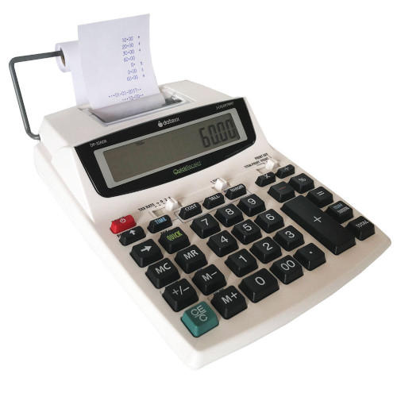

# REPLs and the Dialogue class

The programs in this repository show how to build and test a REPL (Read-Eval-Print-Loop, the core loop of an interactive interpreter).

The most complicated code here is the `Dialogue` class. Given a multi-line interactive session transcript, a `Dialoque` instance emulates user interactions by offering a `fake_input` method which can mock the `input` built-in function in Python 3. Each call to `fake_input` prints a prompt and a fake user input, and returns the same user input string. The `transcript` method returns a multi-line string with all the prompts, user inputs and the outputs expected from the REPL under test. See the `dialogue_test.py` module for two simple REPLs that exercise the `Dialogue` class.

A more interesting REPL example is the `adder.py` module, which can be used from the command line. It's a "adding machine" that does just that: it adds numbers — the most common use of traditional desktop adding machines with paper tape. The file `adder_test.py` is another example of using `Dialogue`.

> My father, Jairo Ramalho, liked to say that an adding machine with paper tape is much better than any modern portable calculator that only shows a number at a time on the screen, because you can easily double check the numbers you typed on the paper tape. My father would enjoy using `adder.py`.

